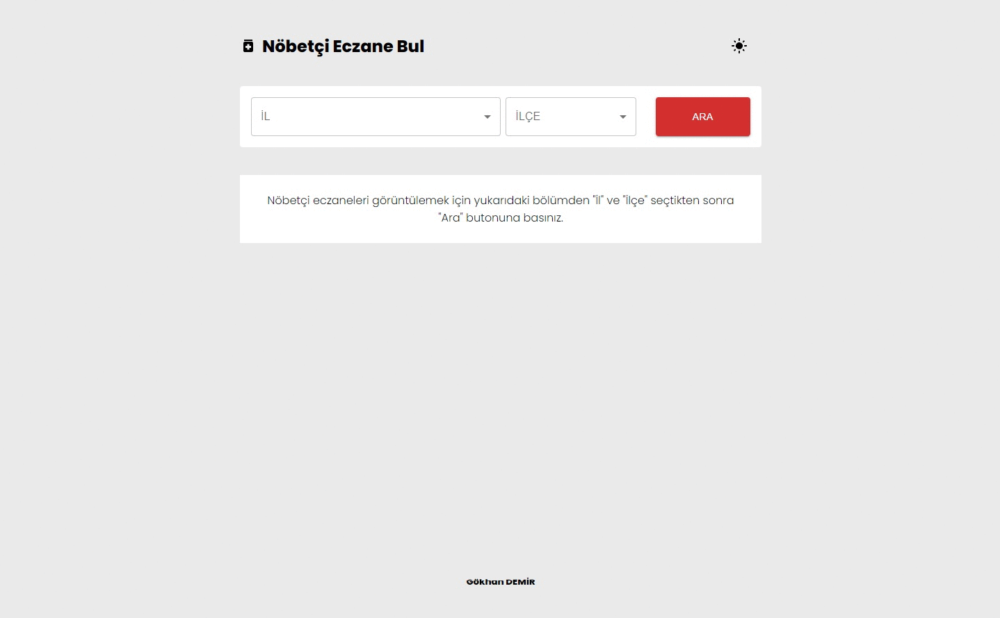

## Vite + React ile Hazırlanan Nöbetçi Eczane Bulma Uygulaması

Selamlar, bu uygulama kullanıcılara seçtikleri il ve ilçelerdeki nöbetçi eczaneleri hızlı ve kolay bir şekilde bulma imkanı sunar. Mobil cihazlar için tasarlanmıştır ve kullanıcı dostu bir arayüze sahiptir.

Demo: https://react-nobetci-eczane-uygulamasi.vercel.app/

---

### Uygulamanın Özellikleri:

- **İl ve İlçelere Göre Listeleme:** Kullanıcın belirlediği il ve ilçelerdeki tüm nöbetçi eczaneleri listeler.
- **Eczaneye Ait Konum ve Detay Bilgisi:** Listelenen eczanelere ait telefon, adres ve konum bilgisini detaylı şekilde sunar.
- **Açık/Koyu Tema Seçeneği:** Açık ve koyu tema seçeneği ile uygulamayı tamamen kullanıcının tercihine bırakır.
- **Responsive Tasarım:** Telefon, tablet, televizyon veya bilgisayardan kolayca ulaşılabilir.

---

### Kullandığım Teknolojiler:

- React + Vite.
- Material UI.
- Axios.

---

### Kurulum ve Kullanım:

- **Adım 1: Klonlama:** `git clone https://github.com/gokhandemr/react-nobetci-eczane-uygulamasi.git`
- **Adım 2: Proje Klasörünü Açma:** `cd react-nobetci-eczane-uygulamasi`  
- **Adım 3: Npm Yükleme:** `npm install`
- **Çalıştırma:** `npm run dev`

---

### İletişim

Soru, görüş ve önerileriniz için _gkhandemir96@gmail.com_ mail adresine mail atabilirsiniz.
